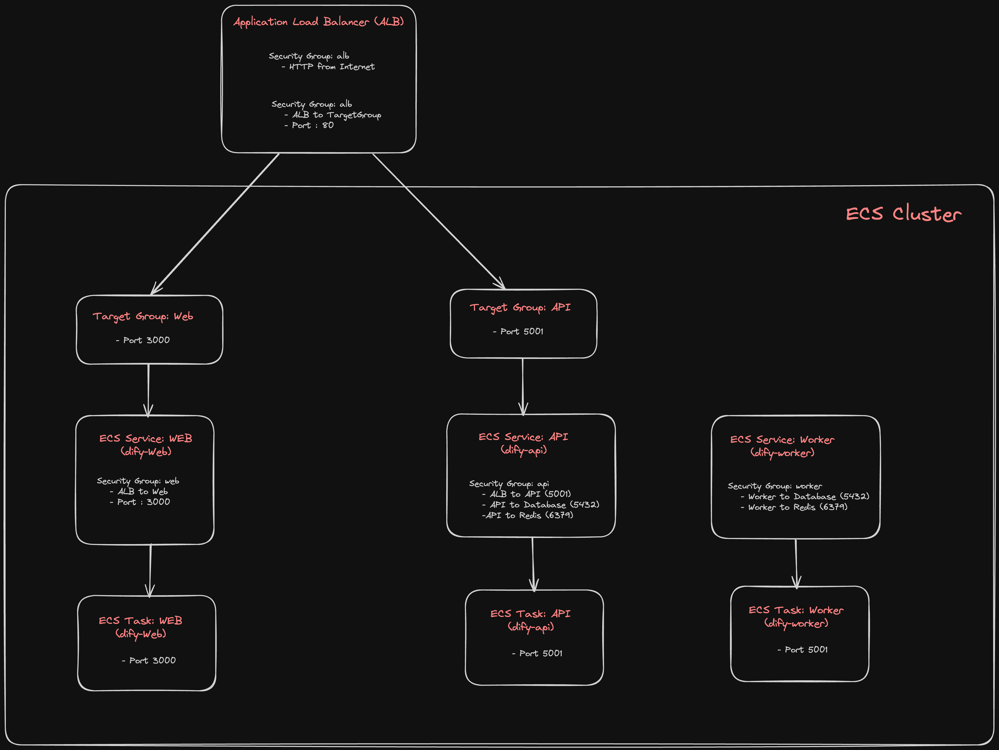

# Design Architecture for the self-hosted Dify Environment with AWS




# ALB
```bash
resource "aws_security_group" "alb" {
  name        = "dify-alb"
  description = "ALB (Reverse Proxy) for Dify"
  vpc_id      = var.vpc_id
  tags        = { Name = "dify-alb" }
}

resource "aws_security_group_rule" "alb_to_targetgroup" {
  security_group_id = aws_security_group.alb.id
  type              = "egress"
  description       = "ALB to TargetGroup"
  protocol          = "all"
  from_port         = 0
  to_port           = 0
  cidr_blocks       = [data.aws_vpc.this.cidr_block]
}

resource "aws_security_group_rule" "http_from_internet" {
  security_group_id = aws_security_group.alb.id
  type              = "ingress"
  description       = "HTTP from Internet"
  protocol          = "tcp"
  from_port         = 80
  to_port           = 80
  cidr_blocks       = var.allowed_cidr_blocks
}

resource "aws_lb" "dify" {
  name               = "dify-alb"
  load_balancer_type = "application"
  subnets            = var.public_subnet_ids
  security_groups    = [aws_security_group.alb.id]
}
```

### Listener Group for WEB
```bash
resource "aws_lb_target_group" "web" {
  name        = "dify-web"
  vpc_id      = var.vpc_id
  protocol    = "HTTP"
  port        = 3000
  target_type = "ip"

  slow_start           = 0
  deregistration_delay = 65

  health_check {
    path     = "/apps" # "/" だと 307 になる
    interval = 10
    # timeout             = 5
    # healthy_threshold   = 3
    # unhealthy_threshold = 5
  }
}

resource "aws_lb_listener" "http" {
  load_balancer_arn = aws_lb.dify.arn
  port              = 80
  protocol          = "HTTP"

  default_action {
    type             = "forward"
    target_group_arn = aws_lb_target_group.web.arn
  }
}

# ALB Listener Rule (API)
# path pattern によって API に振り分ける

locals {
  api_paths = ["/console/api", "/api", "/v1", "/files"]
}
```

### Listener Group for API
```bash
locals {
  api_paths = ["/console/api", "/api", "/v1", "/files"]
}

resource "aws_lb_listener_rule" "api" {
  listener_arn = aws_lb_listener.http.arn
  priority     = 10

  condition {
    path_pattern {
      values = local.api_paths
    }
  }

  action {
    type             = "forward"
    target_group_arn = aws_lb_target_group.api.arn
  }
}

resource "aws_lb_listener_rule" "api_wildcard" {
  listener_arn = aws_lb_listener.http.arn
  priority     = 11

  condition {
    path_pattern {
      values = [for path in local.api_paths : "${path}/*"]
    }
  }

  action {
    type             = "forward"
    target_group_arn = aws_lb_target_group.api.arn
  }
}

resource "aws_lb_target_group" "api" {
  name        = "dify-api"
  vpc_id      = var.vpc_id
  protocol    = "HTTP"
  port        = 5001
  target_type = "ip"

  slow_start           = 0
  deregistration_delay = 65

  health_check {
    path     = "/health"
    interval = 10
    # timeout             = 5
    # healthy_threshold   = 3
    # unhealthy_threshold = 5
  }
}

```

# WEB

## ECS Service:
```bash
resource "aws_ecs_service" "web" {
  name            = "dify-web"
  cluster         = aws_ecs_cluster.dify.name
  desired_count   = var.web_desired_count
  task_definition = aws_ecs_task_definition.dify_web.arn
  propagate_tags  = "SERVICE"
  launch_type     = "FARGATE"

  network_configuration {
    subnets         = var.private_subnet_ids
    security_groups = [aws_security_group.web.id]
  }

  load_balancer {
    target_group_arn = aws_lb_target_group.web.arn
    container_name   = "dify-web"
    container_port   = 3000
  }
}
```

## WEB Security Group
```bash
resource "aws_security_group" "web" {
  name        = "dify-web"
  description = "Dify Web"
  vpc_id      = var.vpc_id
  tags        = { Name = "dify-web" }
}

# インターネットアクセスは不要だが、これがないと ECR からイメージのダウンロードに失敗して
# タスクの起動がエラーになる。VPC エンドポイントを作成できるならそちらの方がベター。
resource "aws_security_group_rule" "web_to_internet" {
  security_group_id = aws_security_group.web.id
  type              = "egress"
  description       = "Web to Internet"
  protocol          = "all"
  from_port         = 0
  to_port           = 0
  cidr_blocks       = ["0.0.0.0/0"]
}

resource "aws_security_group_rule" "alb_to_web" {
  security_group_id        = aws_security_group.web.id
  type                     = "ingress"
  description              = "ALB to Web"
  protocol                 = "tcp"
  from_port                = 3000
  to_port                  = 3000
  source_security_group_id = aws_security_group.alb.id
}
```

## WEB ECS TASK
```bash
resource "aws_ecs_task_definition" "dify_web" {
  family                   = "dify-web"
  execution_role_arn       = aws_iam_role.exec.arn
  task_role_arn            = aws_iam_role.web.arn
  network_mode             = "awsvpc"
  requires_compatibilities = ["FARGATE"]
  cpu                      = 1024 # TODO: variable
  memory                   = 2048 # TODO: variable

  container_definitions = jsonencode([
    {
      name      = "dify-web"
      image     = "langgenius/dify-web:${var.dify_web_version}"
      essential = true
      environment = [
        for name, value in {
          # The base URL of console application api server, refers to the Console base URL of WEB service if console domain is
          # different from api or web app domain.
          # example: http://cloud.dify.ai
          CONSOLE_API_URL = "http://${aws_lb.dify.dns_name}"
          # # The URL for Web APP api server, refers to the Web App base URL of WEB service if web app domain is different from
          # # console or api domain.
          # # example: http://udify.app
          APP_API_URL = "http://${aws_lb.dify.dns_name}"
        } : { name = name, value = tostring(value) }
      ]
      portMappings = [
        {
          hostPort      = 3000
          protocol      = "tcp"
          containerPort = 3000
        }
      ]
      logConfiguration = {
        logDriver = "awslogs"
        options = {
          "awslogs-group"         = aws_cloudwatch_log_group.dify.name
          "awslogs-region"        = var.aws_region
          "awslogs-stream-prefix" = "dify-web"
        }
      }
      cpu         = 0
      volumesFrom = []
      mountPoints = []
    },
  ])

  runtime_platform {
    operating_system_family = "LINUX"
    cpu_architecture        = "ARM64"
  }

  lifecycle {
    create_before_destroy = true
  }
}
```

# API

## ECS Service:
```bash
resource "aws_ecs_service" "api" {
  depends_on      = [aws_lb_listener_rule.api] # ターゲットグループが ALB と紐付いていないと構築時にエラーになる
  name            = "dify-api"
  cluster         = aws_ecs_cluster.dify.name
  desired_count   = var.api_desired_count
  task_definition = aws_ecs_task_definition.dify_api.arn
  propagate_tags  = "SERVICE"
  launch_type     = "FARGATE"

  network_configuration {
    subnets         = var.private_subnet_ids
    security_groups = [aws_security_group.api.id]
  }

  load_balancer {
    target_group_arn = aws_lb_target_group.api.arn
    container_name   = "dify-api"
    container_port   = 5001
  }
}
```

## API Security Group:
```bash
resource "aws_security_group" "api" {
  name        = "dify-api"
  description = "Dify API"
  vpc_id      = var.vpc_id
  tags        = { Name = "dify-api" }
}

# TODO: 公式では SSRF 対策のために Forward Proxy として squid をプロビジョニングしているが、
# 本構成では SSRF 対策の Forward Proxy は省略している。必要な場合は squid のタスクを用意したり、Firewall Manager などを利用する。
resource "aws_security_group_rule" "api_to_internet" {
  security_group_id = aws_security_group.api.id
  type              = "egress"
  description       = "Internet"
  protocol          = "all"
  from_port         = 0
  to_port           = 0
  cidr_blocks       = ["0.0.0.0/0"]
}

resource "aws_security_group_rule" "alb_to_api" {
  security_group_id        = aws_security_group.api.id
  type                     = "ingress"
  description              = "ALB to API"
  protocol                 = "tcp"
  from_port                = 5001
  to_port                  = 5001
  source_security_group_id = aws_security_group.alb.id
}

resource "aws_security_group_rule" "api_to_database" {
  security_group_id        = aws_security_group.database.id
  type                     = "ingress"
  description              = "API to Database"
  protocol                 = "tcp"
  from_port                = 5432
  to_port                  = 5432
  source_security_group_id = aws_security_group.api.id
}

resource "aws_security_group_rule" "api_to_redis" {
  security_group_id        = aws_security_group.redis.id
  type                     = "ingress"
  description              = "API to Redis"
  protocol                 = "tcp"
  from_port                = 6379
  to_port                  = 6379
  source_security_group_id = aws_security_group.api.id
}
```

## API Task Definition
```bash
# Dify API (with Sandbox) Task

resource "aws_ecs_task_definition" "dify_api" {
  family                   = "dify-api"
  execution_role_arn       = aws_iam_role.exec.arn
  task_role_arn            = aws_iam_role.app.arn
  network_mode             = "awsvpc"
  requires_compatibilities = ["FARGATE"]
  cpu                      = 1024 # TODO: variable
  memory                   = 2048 # TODO: variable

  volume {
    name = "dependencies"
  }

  container_definitions = jsonencode([
    {
      name      = "dify-api"
      image     = "langgenius/dify-api:${var.dify_api_version}"
      essential = true
      portMappings = [
        {
          hostPort      = 5001
          protocol      = "tcp"
          containerPort = 5001
        }
      ]
      environment = [
        for name, value in {
          # Startup mode, 'api' starts the API server.
          MODE = "api"
          # The log level for the application. Supported values are `DEBUG`, `INFO`, `WARNING`, `ERROR`, `CRITICAL`
          LOG_LEVEL = "INFO"
          # enable DEBUG mode to output more logs
          # DEBUG  = "true"
          # The base URL of console application web frontend, refers to the Console base URL of WEB service if console domain is
          # different from api or web app domain.
          # example: http://cloud.dify.ai
          CONSOLE_WEB_URL = "http://${aws_lb.dify.dns_name}"
          # The base URL of console application api server, refers to the Console base URL of WEB service if console domain is different from api or web app domain.
          # example: http://cloud.dify.ai
          CONSOLE_API_URL = "http://${aws_lb.dify.dns_name}"
          # The URL prefix for Service API endpoints, refers to the base URL of the current API service if api domain is different from console domain.
          # example: http://api.dify.ai
          SERVICE_API_URL = "http://${aws_lb.dify.dns_name}"
          # The URL prefix for Web APP frontend, refers to the Web App base URL of WEB service if web app domain is different from console or api domain.
          # example: http://udify.app
          APP_WEB_URL = "http://${aws_lb.dify.dns_name}"
          # When enabled, migrations will be executed prior to application startup and the application will start after the migrations have completed.
          MIGRATION_ENABLED = var.migration_enabled
          # The configurations of postgres database connection.
          # It is consistent with the configuration in the 'db' service below.
          DB_USERNAME = var.dify_db_username
          DB_HOST     = aws_rds_cluster.dify.endpoint
          DB_PORT     = aws_rds_cluster.dify.port
          DB_DATABASE = var.dify_db_name
          # The configurations of redis connection.
          # It is consistent with the configuration in the 'redis' service below.
          REDIS_HOST    = aws_elasticache_replication_group.redis.primary_endpoint_address
          REDIS_PORT    = aws_elasticache_replication_group.redis.port
          REDIS_USE_SSL = true
          # use redis db 0 for redis cache
          REDIS_DB = 0
          # Specifies the allowed origins for cross-origin requests to the Web API, e.g. https://dify.app or * for all origins.
          WEB_API_CORS_ALLOW_ORIGINS = "*"
          # Specifies the allowed origins for cross-origin requests to the console API, e.g. https://cloud.dify.ai or * for all origins.
          CONSOLE_CORS_ALLOW_ORIGINS = "*"
          # CSRF Cookie settings
          # Controls whether a cookie is sent with cross-site requests,
          # providing some protection against cross-site request forgery attacks
          #
          # Default = `SameSite=Lax, Secure=false, HttpOnly=true`
          # This default configuration supports same-origin requests using either HTTP or HTTPS,
          # but does not support cross-origin requests. It is suitable for local debugging purposes.
          #
          # If you want to enable cross-origin support,
          # you must use the HTTPS protocol and set the configuration to `SameSite=None, Secure=true, HttpOnly=true`.
          #
          # The type of storage to use for storing user files. Supported values are `local` and `s3` and `azure-blob` and `google-storage`, Default = `local`
          STORAGE_TYPE = "s3"
          # The S3 storage configurations, only available when STORAGE_TYPE is `s3`.
          S3_USE_AWS_MANAGED_IAM = true
          S3_BUCKET_NAME         = aws_s3_bucket.storage.bucket
          S3_REGION              = var.aws_region
          # The type of vector store to use. Supported values are `weaviate`, `qdrant`, `milvus`, `relyt`.
          VECTOR_STORE = "pgvector"
          # pgvector configurations
          PGVECTOR_HOST     = aws_rds_cluster.dify.endpoint
          PGVECTOR_PORT     = aws_rds_cluster.dify.port
          PGVECTOR_USER     = "dify"
          PGVECTOR_DATABASE = "dify"
          # # Mail configuration, support = resend, smtp
          # MAIL_TYPE = ''
          # # default send from email address, if not specified
          # MAIL_DEFAULT_SEND_FROM = 'YOUR EMAIL FROM (eg = no-reply <no-reply@dify.ai>)'
          # SMTP_SERVER = ''
          # SMTP_PORT = 587
          # SMTP_USERNAME = ''
          # SMTP_PASSWORD = ''
          # SMTP_USE_TLS = 'true'
          # The sandbox service endpoint.
          CODE_EXECUTION_ENDPOINT       = "http://localhost:8194" # Fargate の task 内通信は localhost 宛
          CODE_MAX_NUMBER               = "9223372036854775807"
          CODE_MIN_NUMBER               = "-9223372036854775808"
          CODE_MAX_STRING_LENGTH        = 80000
          TEMPLATE_TRANSFORM_MAX_LENGTH = 80000
          CODE_MAX_STRING_ARRAY_LENGTH  = 30
          CODE_MAX_OBJECT_ARRAY_LENGTH  = 30
          CODE_MAX_NUMBER_ARRAY_LENGTH  = 1000
          # Indexing configuration
          INDEXING_MAX_SEGMENTATION_TOKENS_LENGTH = 1000
        } : { name = name, value = tostring(value) }
      ]
      secrets = [
        {
          name      = "SECRET_KEY"
          valueFrom = aws_ssm_parameter.session_secret_key.name
        },
        {
          name      = "DB_PASSWORD"
          valueFrom = aws_ssm_parameter.db_password.name
        },
        {
          name      = "REDIS_PASSWORD"
          valueFrom = aws_ssm_parameter.redis_password.name
        },
        # The configurations of celery broker.
        # Use redis as the broker, and redis db 1 for celery broker.
        {
          name      = "CELERY_BROKER_URL"
          valueFrom = aws_ssm_parameter.broker_url.name
        },
        {
          name      = "PGVECTOR_PASSWORD"
          valueFrom = aws_ssm_parameter.db_password.name
        },
        {
          name      = "CODE_EXECUTION_API_KEY"
          valueFrom = aws_ssm_parameter.sandbox_key.name
        }
      ]
      logConfiguration = {
        logDriver = "awslogs"
        options = {
          "awslogs-group"         = aws_cloudwatch_log_group.dify.name
          "awslogs-region"        = var.aws_region
          "awslogs-stream-prefix" = "dify-api"
        }
      }
      healthCheck = {
        command     = ["CMD-SHELL", "curl -f http://localhost:5001/health || exit 1"]
        interval    = 10
        timeout     = 5
        retries     = 3
        startPeriod = 30
      }
      cpu         = 0
      volumesFrom = []
      mountPoints = []
    },
    // `dify-sandbox:0.2.0` では `/dependencies/python-requirements.txt` が存在しないと起動時エラーになる。
    // そのため、簡易的ではあるが volume を利用して sandbox から見れるファイルを作成する。
    {
      name      = "dify-sandbox-dependencies"
      image     = "busybox:latest" # dify-sandbox イメージより軽量ならなんでもいい
      essential = false
      cpu       = 0
      mountPoints = [
        {
          sourceVolume  = "dependencies"
          containerPath = "/dependencies"
        }
      ]
      entryPoint = ["sh", "-c"]
      command    = ["touch /dependencies/python-requirements.txt && chmod 755 /dependencies/python-requirements.txt"]
    },
    {
      name      = "dify-sandbox"
      image     = "langgenius/dify-sandbox:${var.dify_sandbox_version}"
      essential = true
      mountPoints = [
        {
          sourceVolume  = "dependencies"
          containerPath = "/dependencies"
        }
      ]
      portMappings = [
        {
          hostPort      = 8194
          protocol      = "tcp"
          containerPort = 8194
        }
      ]
      environment = [
        for name, value in {
          GIN_MODE       = "release"
          WORKER_TIMEOUT = 15
          ENABLE_NETWORK = true
          SANDBOX_PORT   = 8194
        } : { name = name, value = tostring(value) }
      ]
      secrets = [
        {
          name      = "API_KEY"
          valueFrom = aws_ssm_parameter.sandbox_key.name
        }
      ]
      logConfiguration = {
        logDriver = "awslogs"
        options = {
          "awslogs-group"         = aws_cloudwatch_log_group.dify.name
          "awslogs-region"        = var.aws_region
          "awslogs-stream-prefix" = "dify-sandbox"
        }
      }
      cpu         = 0
      volumesFrom = []
    },
  ])

  runtime_platform {
    operating_system_family = "LINUX"
    cpu_architecture        = "ARM64"
  }

  lifecycle {
    create_before_destroy = true
  }
}
```

# Worker

## WORKER ECS Service
```bash
resource "aws_ecs_service" "worker" {
  name            = "dify-worker"
  cluster         = aws_ecs_cluster.dify.name
  desired_count   = var.worker_desired_count
  task_definition = aws_ecs_task_definition.dify_worker.arn
  propagate_tags  = "SERVICE"
  launch_type     = "FARGATE"

  network_configuration {
    subnets         = var.private_subnet_ids
    security_groups = [aws_security_group.worker.id]
  }
}
```

## Worker Security Group

```bash
resource "aws_security_group" "worker" {
  name        = "dify-worker"
  description = "Dify Worker"
  vpc_id      = var.vpc_id
  tags        = { Name = "dify-worker" }
}

resource "aws_security_group_rule" "worker_to_internet" {
  security_group_id = aws_security_group.worker.id
  type              = "egress"
  description       = "Internet"
  protocol          = "all"
  from_port         = 0
  to_port           = 0
  cidr_blocks       = ["0.0.0.0/0"]
}

resource "aws_security_group_rule" "worker_to_database" {
  security_group_id        = aws_security_group.database.id
  type                     = "ingress"
  description              = "Worker to Database"
  protocol                 = "tcp"
  from_port                = 5432
  to_port                  = 5432
  source_security_group_id = aws_security_group.worker.id
}

resource "aws_security_group_rule" "worker_to_redis" {
  security_group_id        = aws_security_group.redis.id
  type                     = "ingress"
  description              = "Worker to Redis"
  protocol                 = "tcp"
  from_port                = 6379
  to_port                  = 6379
  source_security_group_id = aws_security_group.worker.id
}
```

## Worker Task Definition
### Note:
The dify-worker task doesn't have any port mappings because it is likely designed to perform background tasks

```bash
# Dify Worker Task
resource "aws_ecs_task_definition" "dify_worker" {
  family                   = "dify-worker"
  execution_role_arn       = aws_iam_role.exec.arn
  task_role_arn            = aws_iam_role.app.arn
  network_mode             = "awsvpc"
  requires_compatibilities = ["FARGATE"]
  cpu                      = 1024 # TODO: variable
  memory                   = 2048 # TODO: variable

  container_definitions = jsonencode([
    {
      name      = "dify-worker"
      image     = "langgenius/dify-api:${var.dify_api_version}"
      essential = true
      environment = [
        for name, value in {
          # Startup mode, 'worker' starts the Celery worker for processing the queue.
          MODE = "worker"

          # --- All the configurations below are the same as those in the 'api' service. ---

          # The log level for the application. Supported values are `DEBUG`, `INFO`, `WARNING`, `ERROR`, `CRITICAL`
          LOG_LEVEL = "INFO"
          # The configurations of postgres database connection.
          # It is consistent with the configuration in the 'db' service below.
          DB_USERNAME = var.dify_db_username
          DB_HOST     = aws_rds_cluster.dify.endpoint
          DB_PORT     = aws_rds_cluster.dify.port
          DB_DATABASE = var.dify_db_name
          # The configurations of redis cache connection.
          REDIS_HOST    = aws_elasticache_replication_group.redis.primary_endpoint_address
          REDIS_PORT    = aws_elasticache_replication_group.redis.port
          REDIS_DB      = "0"
          REDIS_USE_SSL = "true"
          # The type of storage to use for storing user files. Supported values are `local` and `s3` and `azure-blob` and `google-storage`, Default = `local`
          STORAGE_TYPE = "s3"
          # The S3 storage configurations, only available when STORAGE_TYPE is `s3`.
          S3_USE_AWS_MANAGED_IAM = true
          S3_BUCKET_NAME         = aws_s3_bucket.storage.bucket
          S3_REGION              = var.aws_region
          # The type of vector store to use. Supported values are `weaviate`, `qdrant`, `milvus`, `relyt`, `pgvector`.
          VECTOR_STORE = "pgvector"
          # pgvector configurations
          PGVECTOR_HOST     = aws_rds_cluster.dify.endpoint
          PGVECTOR_PORT     = aws_rds_cluster.dify.port
          PGVECTOR_USER     = "dify"
          PGVECTOR_DATABASE = "dify"
          # Mail configuration, support = resend
          # MAIL_TYPE = ''
          # # default send from email address, if not specified
          # MAIL_DEFAULT_SEND_FROM = 'YOUR EMAIL FROM (eg = no-reply <no-reply@dify.ai>)'
          # SMTP_SERVER = ''
          # SMTP_PORT = 587
          # SMTP_USERNAME = ''
          # SMTP_PASSWORD = ''
          # SMTP_USE_TLS = 'true'
          # Indexing configuration
          INDEXING_MAX_SEGMENTATION_TOKENS_LENGTH = "1000"
        } : { name = name, value = tostring(value) }
      ]
      secrets = [
        {
          name      = "SECRET_KEY"
          valueFrom = aws_ssm_parameter.session_secret_key.name
        },
        {
          name      = "DB_PASSWORD"
          valueFrom = aws_ssm_parameter.db_password.name
        },
        {
          name      = "REDIS_PASSWORD"
          valueFrom = aws_ssm_parameter.redis_password.name
        },
        # The configurations of celery broker.
        # Use redis as the broker, and redis db 1 for celery broker.
        {
          name      = "CELERY_BROKER_URL"
          valueFrom = aws_ssm_parameter.broker_url.name
        },
        {
          name      = "PGVECTOR_PASSWORD"
          valueFrom = aws_ssm_parameter.db_password.name
        }
      ]
      logConfiguration = {
        logDriver = "awslogs"
        options = {
          "awslogs-group"         = aws_cloudwatch_log_group.dify.name
          "awslogs-region"        = var.aws_region
          "awslogs-stream-prefix" = "dify-worker"
        }
      }
      cpu         = 0
      volumesFrom = []
      mountPoints = []
    },
  ])

  runtime_platform {
    operating_system_family = "LINUX"
    cpu_architecture        = "ARM64"
  }

  lifecycle {
    create_before_destroy = true
  }
}
```
